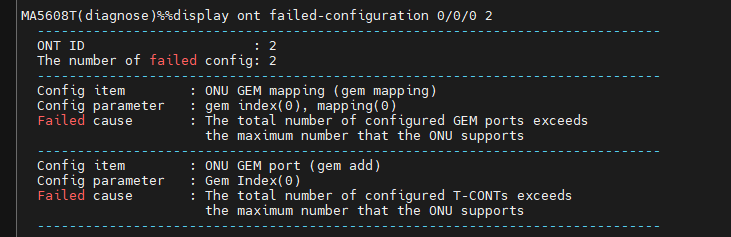
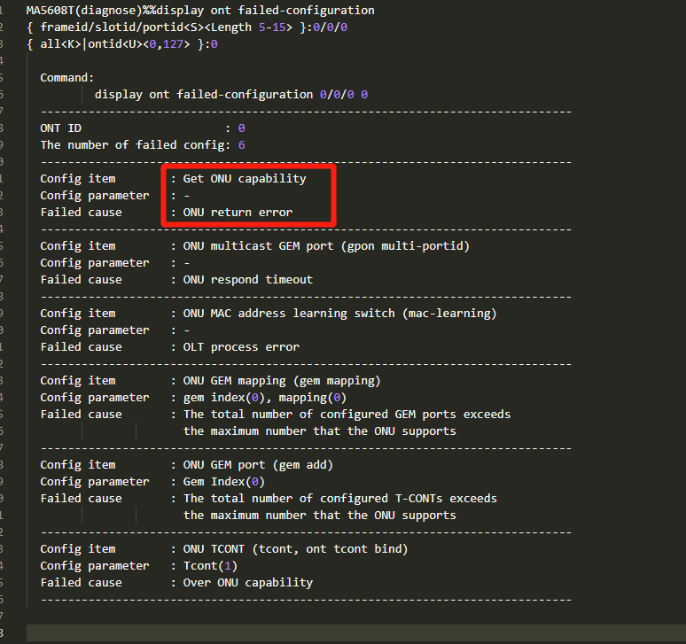
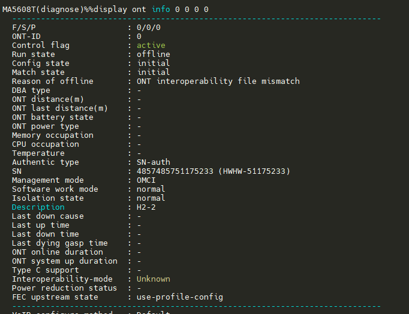

# Huawei Smart-MA5608T

## FAQ
### 1. `ont autofind`成功,但`confirm`失败
 - ONT 产测设置的wan_mac地址(影响sn-auth的id)
 - BOB 的eeprom配置, `vendor id`是否被OLT接受
 - `display ont info` 看到

### 2. ONT Config state: failed
 - `display ont capability` 查看 omci 交互是否成功建立
  
 - 如果异常, 进 diagnose 模式, `display ont failed-configuration` 查看
   - __ONU GEM mapping__

    可能原因: ONT的GEM-port下标要从0开始, 业务用mapping index表示 
   - __Get ONU capability error__

    可能原因: ONT端, omci协议报错, 检查sysinfo.xml/board.xml配置, eth网口数量, 电话口(pots)数量是  否符合硬件设计; 

### 3. ONT interoperatibity file mismatch

可能原因: OLT需要新增第三方ONT对接; 
- 进入diagnose执行 `display xpon ont-interoperation-mode/file` 查询当前配置;
- 修改ont的vendor-id(比如改成: HWTC), 骗过OLT验证
