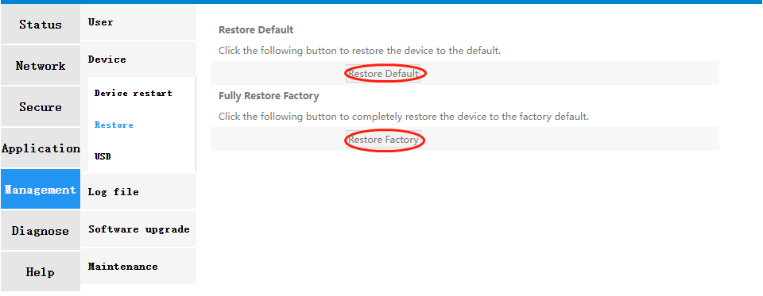
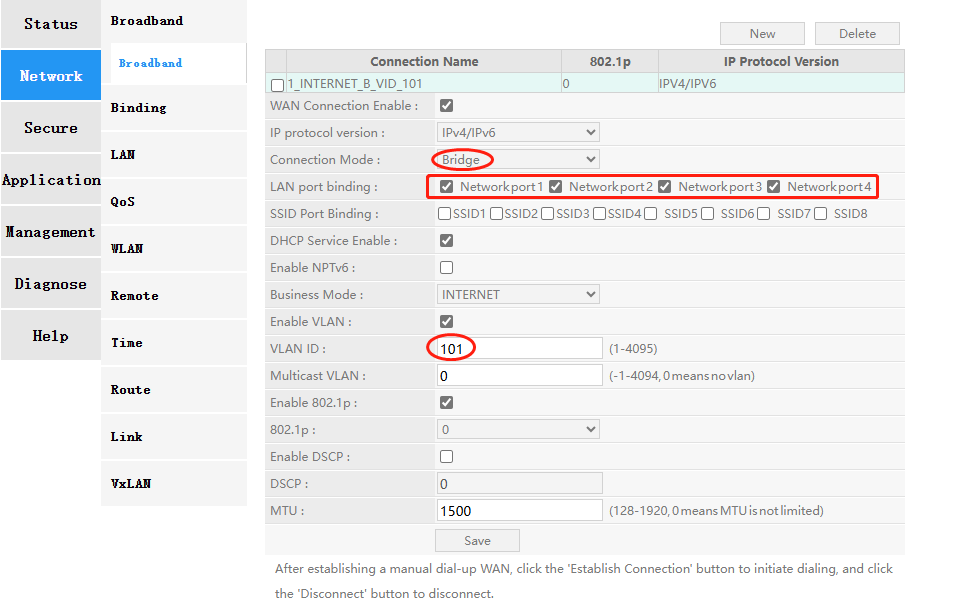
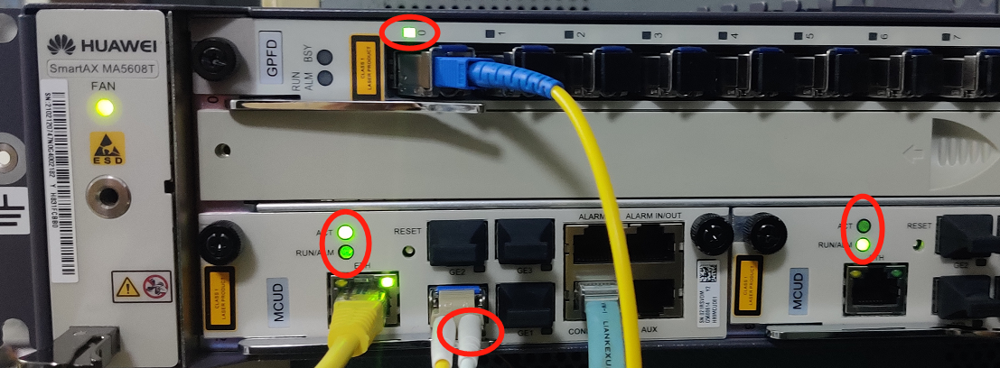
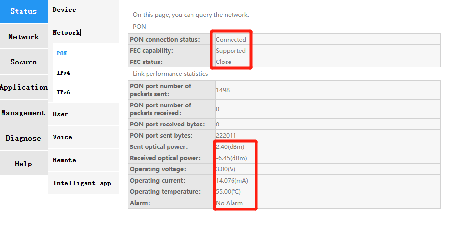

# hi5662y FAQ

- [hi5662y FAQ](#hi5662y-faq)
  - [恢复出厂配置](#恢复出厂配置)
  - [重启生成配置](#重启生成配置)
  - [配置陪测PC的vlan](#配置陪测PC的vlan)


## 恢复出厂配置

<font color=red size=3>__两种方式二选一, 推荐 webui 复位, 不成功再尝试 u-boot 擦除分区__</font>

1. webui 点恢复出厂配置

2. 重启进入u-boot console
```log
U-Boot 2020.01 (Jun 07 2024 - 13:38:06 +0800) for emei

DRAM:  256 MiB
WDT:   Started with servicing (30s timeout)
NAND:  256 MiB
Loading Environment from NAND... OK
In:    uart@0x1010f000
Out:   uart@0x1010f000
Err:   uart@0x1010f000
Reset Info: Linux reboot cmd to reset
Net:   Could not get PHY for eth8: addr 1
gemac@8 no phy device
Warning: pie (eth0) using random MAC address - ca:a4:99:ad:19:1e
eth0: pie
bootflag a bootreg 10
net_loop_init, protocol: 16
multiupg detect
bootdelay is 3000
```

```bash
# 枚举MTD分区
mtd list
```

```log
List of MTD devices:
* nand0
  - type: NAND flash
  - block size: 0x20000 bytes
  - min I/O: 0x800 bytes
  - OOB size: 64 bytes
  - OOB available: 30 bytes
  - 0x000000000000-0x000010000000 : "nand0"
          ...
          - 0x000000180000-0x000000380000 : "fac"
          - 0x000000380000-0x000000580000 : "cfga"
          - 0x000000580000-0x000000780000 : "cfgb"
          ...
          - 0x000000c80000-0x000001280000 : "kernela"
          ...
```

```bash
# mtd erase fac   # 擦除校准和产测数据
mtd erase cfga  # 擦除配置分区a
mtd erase cfgb  # 擦除配置分区b
                                    
```

2. 重启写入产测数据

- 注意看配置的 <font color=red>**注释信息**</font>

```bash
# 启动 linux 后, 进入telnet/console

# 网口数量写错, 会导致omci等查询业务异常退出, GPON不能被OLT获取 capabilitiy
hi_cfm set board.lan_ports eth0,eth1,eth2,eth3

hi_cfm set board.usb2_num 2
hi_cfm set board.usb3_num 0
hi_cfm set board.voice_num 1
hi_cfm set sysinfo.operator CMCC

# 光猫是 HGU, 路由是 router
hi_cfm set sysinfo.mode HGU

# 光猫必填 gpon, 否则配置无法正常生成
hi_cfm set sysinfo.pon_adapt gpon

# MAC 地址不能冲突, 否则OLT 能够 autofind, 但是无法 confirm;
hi_cfm set sysinfo.gateway_mac cc:aa:ee:bb:00:11

hi_cfm set board.wlan24 4
hi_cfm set board.wlan58 4

hi_cfm set board.lan_ports eth0,eth1,eth2,eth3,vap0,vap1,vap2,vap3,%4,vap8,vap9,vap10,vap11

# OLT上线用于 sn-auth 的序列号, loid, 密码;
hi_cfm set sysinfo.product_sn HWHW78560001
hi_cfm set sysinfo.auid.sn 0x48 0x57 0x48 0x57 0x51 0x17 0x52 0x33
hi_cfm set sysinfo.loid 86868686
hi_cfm set sysinfo.lopwd 12345

hi_cfm config

reboot
```

## 重启生成配置
1. webui配置桥模式(业务)

2. OLT 配置
```bash

 ont-srvprofile gpon profile-id 4 profile-name "ftth"
  ont-port pots 1 eth 4
  port vlan eth 1 translation 101 user-vlan 101
  commit
  quit

ont-lineprofile gpon profile-id 4 profile-name "ftth"
  tcont 1 dba-profile-id 3
  gem add 0 eth tcont 1
  gem mapping 0 0 vlan 101
  gem mapping 0 1 vlan 102
  commit
  quit

 <mcu 0/2>
 interface mcu 0/2

 <vlan-config>
 vlan 101 to 104 smart
 port vlan 101 to 104 0/2 0

 <interface gpon 0/2>
 interface gpon 0/0
 port 0 ont-auto-find enable
 port pon-id 0 enable
 port 1 ont-auto-find enable
 ont add 0 1 sn-auth "******" omci ont-lineprofile-id 4 ont-srvprofile-id 4 desc ""

 <bbs-config>
 service-port 24 vlan 101 gpon 0/0/0 ont 2 gemport 0 multi-service user-vlan 101 tag-transform translate
 service-port 25 vlan 102 gpon 0/0/0 ont 2 gemport 0 multi-service user-vlan 102 tag-transform translate


```
3. ONT/ONU在OLT上线



```bash
MA5608T(config)#display ont info 0 0 0 1
  -----------------------------------------------------------------------------
  F/S/P                   : 0/0/0
  ONT-ID                  : 1
  Control flag            : active
  Run state               : online
  Config state            : normal
  Match state             : match
  DBA type                : SR
  ONT distance(m)         : 17
  ONT last distance(m)    : 17
  ONT battery state       : holding state
  ONT power type          : -
  Memory occupation       : -
  CPU occupation          : -
  Temperature             : -
  Authentic type          : SN-auth
  SN                      : 4857485751175233 (HWHW-51175233)
  Management mode         : OMCI
  Software work mode      : normal
  Isolation state         : normal
  ONT IP 0 address/mask   : -
  Description             : ONT_NO_DESCRIPTION
  Last down cause         : LOS
  Last up time            : 2024-06-14 19:23:16+08:00
  Last down time          : 2024-06-14 19:22:14+08:00
  Last dying gasp time    : -
  ONT online duration     : 0 day(s), 0 hour(s), 36 minute(s), 4 second(s)
  ONT system up duration  : -
  Type C support          : Not support
  Interoperability-mode   : ITU-T
  Power reduction status  : -
  FEC upstream state      : use-profile-config
  -----------------------------------------------------------------------------
  VoIP configure method   : Default
  -----------------------------------------------------------------------------
  Line profile ID      : 4
  Line profile name    : ftth
  -----------------------------------------------------------------------------
  FEC upstream switch :Disable
  OMCC encrypt switch :Off
  Qos mode            :PQ
  Mapping mode        :VLAN
  TR069 management    :Disable
  TR069 IP index      :0
  ------------------------------------------------------------------------------
  Notes: * indicates Discrete TCONT(TCONT Unbound)
  ------------------------------------------------------------------------------
  <T-CONT   0>          DBA Profile-ID:1
  <T-CONT   1>          DBA Profile-ID:3
   <Gem Index 0>
   --------------------------------------------------------------------
   |Serv-Type:ETH |Encrypt:off |Cascade:off |GEM-CAR:-            |
   |Upstream-priority-queue:0  |Downstream-priority-queue:-       |
   --------------------------------------------------------------------
    Mapping VLAN  Priority Port    Port  Bundle  Flow  Transparent
    index                  type    ID    ID      CAR
   --------------------------------------------------------------------
    0       101   -        -       -     -       -     -
    1       102   -        -       -     -       -     -
    2       103   -        -       -     -       -     -
    3       104   -        -       -     -       -     -
   --------------------------------------------------------------------

  ------------------------------------------------------------------------------
  Notes: Run the display traffic table ip command to query
         traffic table configuration
  -----------------------------------------------------------------------------
  Service profile ID   : 4
  Service profile name : ftth
  -----------------------------------------------------------------------------
  Port-type     Port-number     Max-adaptive-number
  -----------------------------------------------------------------------------
  POTS          1               -
  ETH           4               -
  VDSL          0               -
  TDM           0               -
  MOCA          0               -
  CATV          0               -
  -----------------------------------------------------------------------------
  TDM port type                     : E1
  TDM service type                  : TDMoGem
  MAC learning function switch      : Enable
  ONT transparent function switch   : Disable
  Ring check switch                 : Enable
  Ring port auto-shutdown           : Enable
  Ring detect frequency             : 8 (pps)
  Ring resume interval              : 300 (s)
  Multicast forward mode            : Unconcern
  Multicast forward VLAN            : -
  Multicast mode                    : Unconcern
  Upstream IGMP packet forward mode : Unconcern
  Upstream IGMP packet forward VLAN : -
  Upstream IGMP packet priority     : -
  Native VLAN option                : Concern
  Upstream PQ color policy          : -
  Downstream PQ color policy        : -
  Monitor link                      : Unconcern
  MTU(byte)                         : Unconcern
  -----------------------------------------------------------------------------
  ...

```

## 配置陪测PC的vlan

```bash
# 例如: 桥模式, GPON 配置了 101 的vlan绑定, 则 OLT 的UPLink对接网口也需要配置101 vlan
ip link add link i219 name i219.101 type vlan id 101

```
